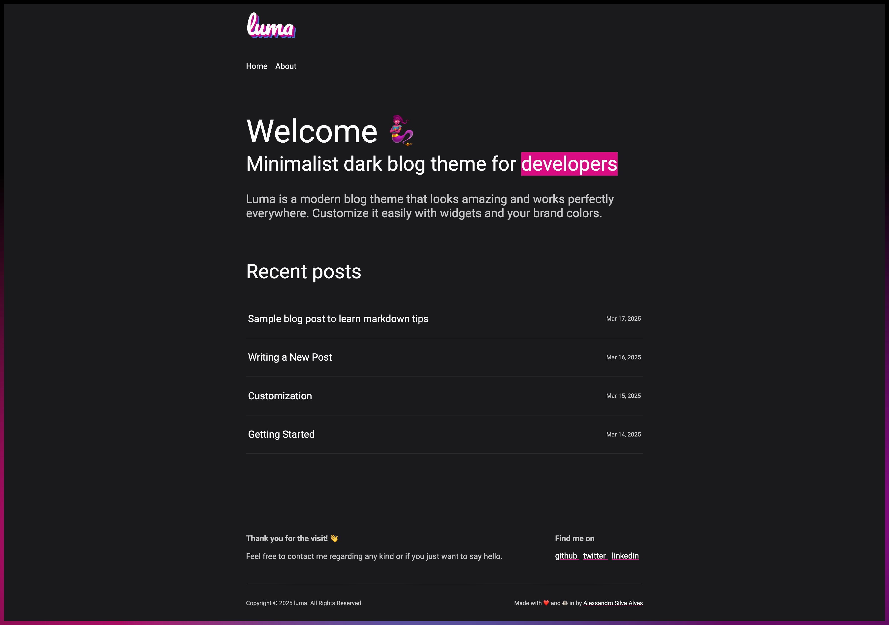

<div align="center">

# 🧞‍♀️ Luma

**A minimalist dark blog theme for Jekyll**

[](https://rubygems.org/gems/luma-jekyll)
[](https://jekyllrb.com/)
[](./LICENSE.txt)

[Live Demo](https://alexsandro-sa.com.br/luma-jekyll) · [Changelog](./CHANGELOG.md) · [Report Bug](https://github.com/AlexsandroSA/luma-jekyll/issues)



</div>

---

## 📑 Table of Contents

- [Features](#-features)
- [Requirements](#-requirements)
- [Quick Start](#-quick-start)
- [GitHub Pages Deployment](#-github-pages-deployment)
- [Configuration](#%EF%B8%8F-configuration)
- [Customization](#-customization)
- [File Structure](#-file-structure)
- [Development](#-development)
- [Contributing](#-contributing)
- [License](#-license)

---

## ✨ Features

| Feature | Description |
|---------|-------------|
| 🌙 Dark Design | Elegant minimalist dark theme, easy on the eyes |
| 📱 Responsive | Fully mobile-friendly and adapts to all screen sizes |
| ⚡ Performance | Optimized for fast load times and SEO |
| 📊 Analytics | Built-in Google Analytics support |
| 🎨 Customizable | Built with Sass for easy styling modifications |
| 🔌 Easy Setup | Simple gem installation, works out of the box |
| 🐙 GitHub Pages | Compatible with GitHub Pages hosting |

---

## 📋 Requirements

- Ruby `>= 2.7`
- Jekyll `>= 4.2`
- Bundler `>= 2.0`

---

## 🚀 Quick Start

### 1. Add Luma to your Gemfile

```ruby
gem "luma-jekyll"
```

### 2. Set the theme in `_config.yml`

```yaml
theme: luma-jekyll
```

### 3. Install dependencies

```sh
bundle install
```

### 4. Start your site

```sh
bundle exec jekyll serve
```

Visit **[http://localhost:4000](http://localhost:4000)** to see your site in action.

---

## 🐙 GitHub Pages Deployment

To use Luma with GitHub Pages, use the `jekyll-remote-theme` plugin:

### 1. Update your `Gemfile`

```ruby
gem "jekyll-remote-theme"
```

### 2. Configure `_config.yml`

```yaml
plugins:
  - jekyll-remote-theme

remote_theme: AlexsandroSA/luma-jekyll
```

### 3. Push to GitHub

Commit and push your changes. GitHub Pages will automatically build and deploy your site.

---

## ⚙️ Configuration

Customize your site by editing `_config.yml`:

```yaml
# Site Settings
title: Your Site Title
description: A brief description of your site
url: https://yourdomain.com
baseurl: ""

# Author
author:
  name: Your Name
  email: your@email.com

# Social Links
social:
  github: your-username
  twitter: your-handle
  linkedin: your-profile

# Analytics
google_analytics: UA-XXXXXXXX-X
```

---

## 🎨 Customization

### Overriding Theme Files

Copy any file from the theme's directories into your site to customize:

| Directory | Purpose |
|-----------|---------|
| `_layouts/` | Page templates (default, home, post, page) |
| `_includes/` | Reusable components (header, footer, head) |
| `_sass/` | Sass partials and variables |
| `assets/` | CSS, images, and static files |

### Custom Styles

Create or edit `assets/css/style.scss` in your site:

```scss
---
---

// Override variables before importing the theme
$primary-color: #E9967A;
$background-color: #1a1a1a;

@import "luma";
```

### Adding Pages

Create Markdown or HTML files in your site root:

```yaml
---
layout: page
title: About
permalink: /about/
---

Your content here...
```

---

## 📁 File Structure

```
luma-jekyll/
├── _includes/
│   ├── footer.html
│   ├── google-analytics.html
│   ├── head.html
│   └── header.html
├── _layouts/
│   ├── default.html
│   ├── home.html
│   ├── page.html
│   └── post.html
├── _posts/
│   └── (your blog posts)
├── assets/
│   ├── css/
│   │   └── style.scss
│   └── image/
│       └── favicon.ico
├── _config.yml
└── index.html
```

---

## 🧑‍💻 Development

To contribute to or modify the theme:

```sh
# Clone the repository
git clone https://github.com/AlexsandroSA/luma-jekyll.git
cd luma-jekyll

# Install dependencies
bundle install

# Start development server
bundle exec jekyll serve --livereload
```

### Building the Gem

```sh
gem build luma-jekyll.gemspec
gem push luma-jekyll-*.gem
```

> **Note:** Only files in `_layouts`, `_includes`, `_sass`, and `assets` are bundled in the gem. Update the regexp in `luma-jekyll.gemspec` to include additional files.

---

## 🤝 Contributing

Contributions are welcome! Here's how you can help:

1. Fork the repository
2. Create a feature branch (`git checkout -b feature/amazing-feature`)
3. Commit your changes (`git commit -m 'Add amazing feature'`)
4. Push to the branch (`git push origin feature/amazing-feature`)
5. Open a Pull Request

Please read our [Contributing Guidelines](https://github.com/AlexsandroSA/luma-jekyll/issues) and follow the [Contributor Covenant](https://www.contributor-covenant.org/) code of conduct.

---

## 📄 License

Distributed under the **MIT License**. See [`LICENSE.txt`](./LICENSE.txt) for more information.

---

<div align="center">

Made with ♥ by [Alexsandro Alves](https://github.com/AlexsandroSA)

⭐ Star this repo if you find it useful!

</div>
